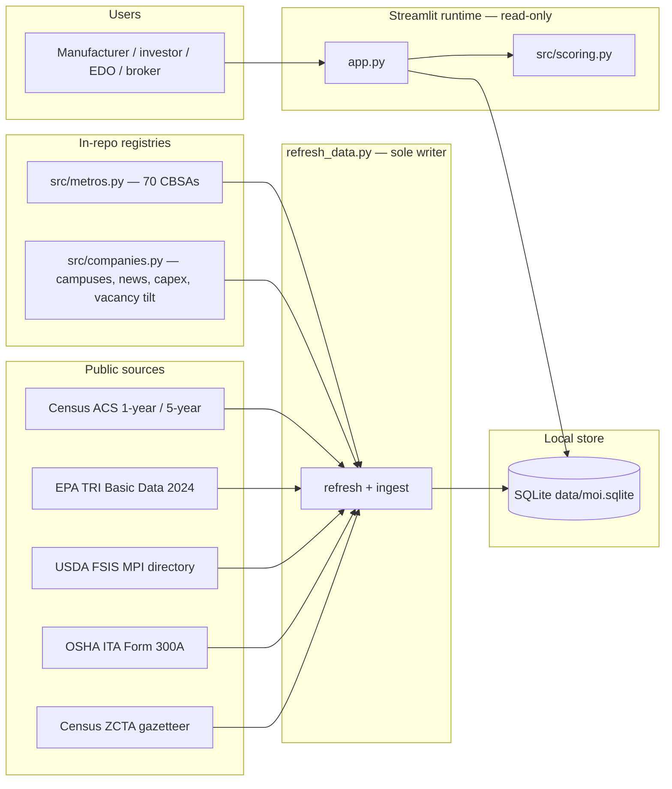
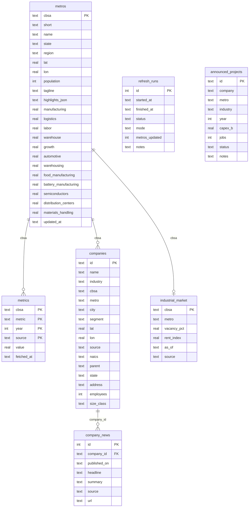
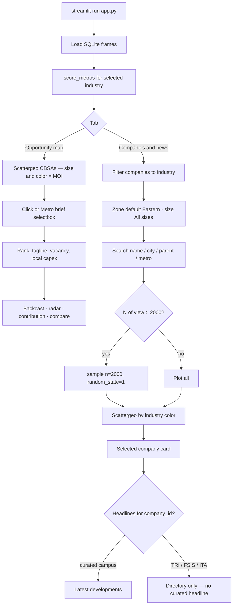

# Manufacturing Opportunity Index — Architecture

The Manufacturing Opportunity Index (MOI) is a local Streamlit POC that ranks 70 US metros for seven industrial uses — automotive, warehousing, food manufacturing, battery manufacturing, semiconductors, distribution centers, and materials handling & forklifts — and maps named plants and warehouses already on the ground.

It is a site-selection and industrial-demand lens, not a licensed real-estate product and not a census of every US establishment. Colliers’ Q2 2026 print (demand over new supply for the first time since 2022; national vacancy 7.3%) is the market context the UI cites. The math is a five-pillar metro score plus a cluster overlay; the company map is a separate federal-directory layer.

This document describes the system as it exists now: curated metro seed → optional Census ACS blend → SQLite → in-process scoring → read-only Streamlit UI, with EPA TRI, USDA FSIS, and OSHA ITA plants loaded by `refresh_data.py`. GitHub-rendered overview diagrams are in the [README Architecture section](README.md#architecture).

---

## 1. Purpose and audience

**Job.** Help a user answer: *which metros are structurally attractive for this industry, and which named facilities already sit there?*

**Industries.** Seven `IndustryProfile` keys in `src/scoring.py`:

| Key | Label | What the profile is for |
| --- | --- | --- |
| `automotive` | Automotive | OEM assembly, Tier-1/2 suppliers, EV transition |
| `warehousing` | Warehousing | Bulk storage, 3PL, cold chain, industrial inventory |
| `food_manufacturing` | Food manufacturing | Processing, CPG, cold storage, ingredient inbound |
| `battery_manufacturing` | Battery manufacturing | Cells, modules, packs, EV supply-chain co-location |
| `semiconductors` | Semiconductors | Fabs, ATMP, materials, CHIPS-aligned ecosystems |
| `distribution_centers` | Distribution centers | Fulfillment, sortation, two-day population coverage |
| `materials_handling` | Materials handling & forklifts | Industrial trucks, conveyors, cranes, warehouse equipment |

**Audiences.** The sidebar “Audience lens” changes copy, not scores:

| Audience | Narrative the UI writes toward |
| --- | --- |
| Manufacturers | Labor, utilities, suppliers, time-to-production |
| Investors | Occupier depth, rent growth, cluster follow-on |
| Consultants | Transparent, factor-level ranking for a workshop |
| Economic development | Peer-metro benchmarking for EDOs |
| Logistics companies | Density, backhaul, DC concentration |
| Real estate | Residual industrial demand after the 2022–25 supply wave |
| Equipment dealers | Where plants and warehouses are expanding |

The 70-metro panel is a calibrated CBSA set (South 30, Midwest 17, West 15, Northeast 8), not the full 387 MSA universe.

---

## 2. System context

Two processes touch the database. `refresh_data.py` is the only writer. `streamlit run app.py` is read-only against `data/moi.sqlite` (it will seed an empty database from Python registries, but it never downloads Census or facility files).



**Trust boundary.** There is no auth, no multi-user server, and no hosted API. The app binds locally (default [http://localhost:8501](http://localhost:8501)). Secrets are limited to an optional `CENSUS_API_KEY` in `.env` (gitignored). Raw downloads land in `data/raw/` (gitignored). The SQLite file is also gitignored.

---

## 3. Runtime architecture

```
app.py                     Streamlit UI (tabs, sidebar, Plotly maps)
src/scoring.py             MOI formula, industry weights, contribution bars
src/metros.py              70-CBSA seed + metros_frame() loader
src/db.py                  Schema, WAL SQLite, seed and read helpers
src/companies.py           Curated campuses, headlines, capex, vacancy tilt
src/ingest_facilities.py   TRI / FSIS / ITA download, NAICS map, dedup
refresh_data.py            Census blend + facility ingest + refresh_runs
```

Dependencies (`requirements.txt`): Streamlit, Plotly, pandas, numpy. HTTP is stdlib `urllib`. No separate API service.

### 3.1 Process split

| Process | Role |
| --- | --- |
| `python refresh_data.py` | Opens SQLite with write intent. Upserts metros, metrics, Wave 3 layers, and public facilities. Records a `refresh_runs` row. |
| `streamlit run app.py` | Loads metros, companies, news, projects, and industrial market. Scores the filtered panel **in memory**. Never writes Census or facility rows. |

On first launch against an empty `data/moi.sqlite`, `load_metros_frame()` / `seed_from_registry()` inserts the 70 seed metros and 76 curated campuses. That is not a substitute for `refresh_data.py`: public TRI/FSIS/ITA rows appear only after refresh.

SQLite is opened with `journal_mode=WAL` and `foreign_keys=ON`. `check_same_thread=False` exists so Streamlit reruns can share connections created in helpers; each loader still opens and closes its own connection.

### 3.2 UI shell

`app.py` is a single-page app (`layout="wide"`). Theme tokens live in `.streamlit/config.toml` (paper `#F7F4EC`, navy `#1F4E79`, copper `#B45309`). Two tabs:

1. **Opportunity map** — CBSA bubbles, rankings table, metro brief, radar, contribution, compare-metros bars, equal-weight backcast.
2. **Companies and news** — facility scatter, zone and size filters, search, selected-site card, industry roster, announced capex, headline feed. The tab body runs only when selected (`tab_cos.open`).

Sidebar controls (shared by both tabs):

- Industry (seven profiles)
- Audience lens (copy only)
- Region: United States / Midwest / South / West / Northeast (Census-style metro filter; not the companies-tab Zone)
- Minimum metro population
- Score mode: **Industry-weighted MOI** vs **Equal-weight pillars**
- Optional pillar-weight and cluster-overlay sliders (normalized at score time)

Session state holds `selected_metro` (default Dallas) and `selected_company` (default `hyundai-savannah`). Map clicks use Plotly `on_select="rerun"`.

### 3.3 Scoring formula

Pillar values are **structural metro attributes** stored on `metros` (0–100). They do not change when the user switches industry. Industry only changes the weights \(w_i\) and the cluster blend \(\lambda\).

\[
\mathrm{MOI} = (1 - \lambda) \cdot \sum_i w_i \cdot \mathrm{Pillar}_i + \lambda \cdot \mathrm{Cluster}
\]

Implemented in `opportunity_index()` (`src/scoring.py`). Weights are normalized by their sum. Score is rounded to one decimal; rank is `min` method, then sort by score descending, short name ascending.

| Pillar | Column | What it represents |
| --- | --- | --- |
| Manufacturing | `manufacturing` | Production base and supplier density |
| Logistics | `logistics` | Highway, rail, air cargo, port access |
| Labor | `labor` | Availability, cost, and skills |
| Warehouse | `warehouse` | Industrial inventory, land, permit velocity |
| Growth | `growth` | Population, output, construction momentum |

`Cluster` is the metro’s industry-specific affinity column (`automotive`, `warehousing`, `materials_handling`, …), also 0–100, curated in `src/metros.py`.

**Equal-weight mode** sets each pillar weight to 0.20 and \(\lambda = 0\). On the seed panel that produces the README landmarks (Indianapolis ~84.4, Columbus OH ~86.8, Dallas ~87.8, Atlanta ~85.8).

**Contribution bars** decompose the selected metro’s MOI into five pillar terms plus `{industry} cluster`. The breakdown always uses the industry’s default \(\lambda\), even if the sidebar cluster slider or equal-weight mode changed the score. Treat the bars as the default-profile decomposition.

### 3.4 Wave 3 layers (runtime, not scoring)

After scoring, the app left-joins `industrial_market` on `cbsa` for vacancy % and rent index. Announced capex/jobs come from `announced_projects`. The 2021–2026 line chart reads `metrics` where `metric = 'equal_weight_moi'` (Wave 3 placeholder, not live QCEW).

---

## 4. Data architecture

Canonical file: `data/moi.sqlite`. Schema is applied on every `connect()` via `CREATE TABLE IF NOT EXISTS` plus `_ensure_metro_columns` (cluster cols including `materials_handling`) and `_ensure_company_columns` (`employees`, `size_class`, and earlier source fields).



`announced_projects` is keyed by metro **short name**, not a foreign key. `companies.cbsa` is nullable when a plant is more than 90 miles from every panel centroid; `metro` then falls back to `"city, state"`.

### 4.1 Seed vs live

| Layer | Seed (in-repo) | Live (refresh) |
| --- | --- | --- |
| 70 CBSAs, pillars, clusters, taglines | `src/metros.py` `METROS` | Optional ACS blend overwrites **population, manufacturing, labor, warehouse, growth**. Logistics and all seven cluster scores stay seed. |
| Curated campuses (76) | `src/companies.py` `COMPANIES` | Re-inserted every refresh (`source = curated`). Most coordinates are metro-centroid jitter (~0.22°). Materials-handling OEM campuses ship explicit lat/lon. |
| Headlines (35) | `NEWS` | Only for curated `company_id`s. TRI/FSIS/ITA sites have no news rows. |
| Capex (12) | `PROJECTS` | Static Wave 3 tracker. |
| Vacancy / rent | `VACANCY_TILT` (28 named metros; others default 7.3%) | Model tilt on Colliers Q2 2026 national 7.3%. Rent index is `40 + 0.45·warehouse + (10 − vacancy)`. |
| Equal-weight backcast | 2021–2026 drift around current equal-weight | `metrics.equal_weight_moi` / `source = wave3_backcast` |
| Named plants | none in git | EPA TRI + USDA FSIS + OSHA ITA into `companies` |
| ACS indicators | none unless Census ran | `metrics` rows for population, unemployment, manufacturing share, transport share, bachelor’s share, pop CAGR |

Last successful refresh on this machine was `--seed-only` (mode `seed`). The metro pillars in SQLite are therefore the curated seed, and `metrics` currently holds the 420 backcast rows (70 × 6 years) only — no ACS series until a Census run succeeds.

### 4.2 Company sources and counts

One physical plant can produce **two SQL rows** when NAICS 493 (or a fulfillment-style name) maps to both `warehousing` and `distribution_centers`. Counts below are **row counts**, not unique rooftops.

Snapshot from `data/moi.sqlite` after OSHA ITA ingest plus materials-handling NAICS 33392 (approximate; re-refresh will move these):

| Industry | Rows | Notes |
| --- | ---: | --- |
| Food manufacturing | ~17,300 | FSIS (all inspected plants, NAICS forced to 311) + TRI 311/3121 + ITA 311/3121 |
| Warehousing | ~12,500 | Almost the same set as DCs (dual tag) |
| Distribution centers | ~12,500 | Dual-tagged with warehousing |
| Automotive | ~4,100 | NAICS 3361 / 3362 / 3363 |
| Semiconductors | ~1,600 | NAICS 3344 |
| Materials handling & forklifts | ~860 | NAICS 33392* + OEM/name match on NAICS 33*; 773 ITA, 76 TRI, 9 curated |
| Battery manufacturing | ~300 | NAICS 33591 plus name/OEM match on NAICS 32/33 |
| **All rows** | **~49,100** | Including 76 curated campuses |

Eastern zone (default companies-tab filter) holds about **23,200** of those rows. National total is about **49,123**.

| `source` | What it is | Geocode |
| --- | --- | --- |
| `curated` | Hand-picked campuses (Tesla, TSMC, Hyundai, FedEx, …) | Jitter around metro centroid |
| `epa_tri` | TRI reporters, reporting year 2024 (2023 URL fallback) | True facility lat/lon |
| `usda_fsis` | Federally inspected meat/poultry/egg plants (MPI API) | True lat/lon from `geolocation` |
| `osha_ita` | Form 300A establishments (CY 2025 CSV + optional 2024 zip) | Census ZCTA centroid + small hash jitter (~0.028°) |

By source on the current file: OSHA ITA ~39k, FSIS ~6.7k, TRI ~3.1k, curated 76.

**Primary key.** Public rows use `{source}:{ext_id}:{industry}` so a TRI plant that is both auto and battery can exist twice.

### 4.2a Employment size (ITA only)

OSHA ITA Form 300A includes `annual_average_employees`. Ingest parses that into `companies.employees` and bins `size_class`:

| `size_class` | Annual average employees |
| --- | --- |
| Small | < 50 |
| Medium | 50–249 |
| Large | 250–999 |
| Extra Large | 1,000+ |
| Unknown | Missing, unparseable, or non-ITA source |

TRI, FSIS, and curated campuses are stored as `Unknown`. The companies-tab size control hides those rows unless **All sizes** is selected. Size is a UI filter, not a scoring input.

### 4.3 NAICS mapping

From `industries_for()` in `src/ingest_facilities.py`:

| NAICS prefix | MOI industry |
| --- | --- |
| 3361, 3362, 3363 | automotive |
| 311, 3121 | food_manufacturing |
| 3344 | semiconductors |
| 33591 | battery_manufacturing |
| 33392 | materials_handling (333922 conveyors, 333923 cranes, 333924 industrial trucks) |
| 493 | warehousing **and** distribution_centers |

Name overlays (applied if NAICS did not already assign):

- Battery: phrase regex (gigafactory, Ultium, cell manufact, …) or OEM regex (Panasonic Energy, SK On, LG Energy, CATL, …), only when NAICS starts with 32/33 or is missing.
- Materials handling: `MH_NAME_RE` (forklift, lift truck, Crown Equipment, Toyota Material, Hyster, Yale, Jungheinrich, …), only when NAICS starts with 33 or is missing.
- DC / warehouse: fulfillment / distribution / sortation / delivery-station phrases.

FSIS skips NAICS and assigns every geocoded establishment to `food_manufacturing`.

### 4.4 Dedup

Public rows are concatenated, then collapsed on:

`industry | normalized name | state | city[:24]`

Name normalization uppercases, strips legal suffixes (LLC, INC, …), and drops non-alphanumerics. Source rank keeps **TRI over FSIS over ITA**. Curated rows are not in that pass; they are inserted first and survive because ingest only `DELETE`s `source IN ('epa_tri','usda_fsis','osha_ita')`.

### 4.5 Metro attach

Haversine nearest-neighbor against the 70 seed centroids, **90-mile** cutoff. Beyond that, `cbsa` is empty and the map still plots the plant at its own lat/lon.

---

## 5. Ingest / refresh pipeline

```mermaid
sequenceDiagram
    actor Op as Operator
    participant R as refresh_data.py
    participant C as Census ACS API
    participant F as ingest_facilities
    participant Raw as data/raw/
    participant DB as data/moi.sqlite

    Op->>R: python refresh_data.py [--seed-only] [--blend 0.55]
    R->>DB: start_refresh_run(mode)
    R->>DB: seed_from_registry / upsert METROS

    alt mode = census (default)
        R->>C: ACS 1-year then 5-year, years 2024→2021
        alt ACS payload
            R->>C: population, year−5 (CAGR)
            R->>DB: blended pillars + metrics rows
        else missing key or HTTP failure
            R->>DB: seed pillars, status partial
        end
    else mode = seed (--seed-only)
        R->>DB: restore curated pillars (skip ACS)
    end

    R->>DB: seed_company_layers(force) — 76 campuses, news, capex, vacancy, backcast
    R->>F: ingest_public_facilities(force)
    F->>Raw: TRI CSV, FSIS JSON, ITA CSV/zip, ZCTA zip (cache if >10 KB)
    F->>DB: DELETE public sources; INSERT mapped plants
    R->>DB: finish_refresh_run(status, notes)
```

### 5.1 Commands

```bash
python refresh_data.py              # mode=census — ACS blend, then facilities
python refresh_data.py --seed-only  # mode=seed — restore seed metros, then facilities
python refresh_data.py --blend 0.6  # live Census percentile weight (default 0.55)
```

`--seed-only` skips **Census ACS only**. It still downloads and loads TRI, FSIS, and OSHA ITA. (The argparse help text that says “skip public APIs” is stale relative to the body of `refresh()`.)

### 5.2 Census ACS (optional key)

`.env.example` documents `CENSUS_API_KEY` (free signup). `refresh_data.py` loads `.env` into the process environment. Without a key, the Census endpoint often returns an HTML “Missing Key” page; the client latches `_census_key_missing` and skips further ACS calls. Refresh then stores the seed panel, sets status `partial`, and **still** runs facility ingest.

Tried in order: years `(2024, 2023, 2022, 2021)` × datasets `acs/acs1/profile` then `acs/acs5/profile`. Variables:

| Metric | ACS code | Used for |
| --- | --- | --- |
| `acs_population` | DP05_0001E | Metro population; 5-year CAGR |
| `unemployment_rate` | DP03_0005PE | Labor (inverted percentile) |
| `manufacturing_share` | DP03_0035PE | Manufacturing percentile |
| `transport_share` | DP03_0041PE | Warehouse percentile |
| `bachelors_share` | DP02_0068PE | Labor (45% of the live mix) |

Live labor = `0.55 · (100 − unemployment percentile) + 0.45 · bachelor’s percentile`. Percentiles are ranked **inside the 70-metro panel**, not the full ACS metro/micro extract. Blend:

```
stored = round(clip(blend_weight · live + (1 − blend_weight) · seed, 0, 100))
```

Default `blend_weight = 0.55`. Logistics and cluster columns are not in this blend.

### 5.3 Facility downloads and cache

`src/ingest_facilities.py` writes under `data/raw/`. `_download()` reuses a file if it already exists and is larger than 10,000 bytes.

| File | URL (as coded) |
| --- | --- |
| `tri_2024_US.csv` (or 2023 fallback) | EPA `efservice` TRI basic download |
| `fsis_mpi.json` | `https://www.fsis.usda.gov/fsis/api/establishments/mpi` |
| `ita_300a_2025.csv` | OSHA ITA 300A summary through 2026-03-15 |
| `ita_300a_2024.zip` | OSHA ITA 2024 archive (optional; failure is logged and skipped) |
| `zcta_national_2025.zip` | Census 2025 ZCTA national gazetteer |

TRI and ITA failures are caught per source; a partial insert is allowed. Each source is logged (`TRI mapped facilities`, `FSIS geocoded establishments`, `ITA mapped facilities`).

Refresh run notes look like: `named plants 48,378 auto=… food=… semi=… battery=… warehouse=… dc=… mh=…`.

---

## 6. Scoring and industry weights

Industry selection does **not** rewrite pillar columns. It selects an `IndustryProfile` (`weights` + `cluster_blend` + copy).

| Industry | Mfg | Logistics | Labor | Warehouse | Growth | λ (cluster) |
| --- | ---: | ---: | ---: | ---: | ---: | ---: |
| Automotive | 0.30 | 0.18 | 0.22 | 0.12 | 0.18 | 0.18 |
| Warehousing | 0.08 | 0.28 | 0.18 | 0.30 | 0.16 | 0.16 |
| Food manufacturing | 0.24 | 0.20 | 0.22 | 0.18 | 0.16 | 0.16 |
| Battery manufacturing | 0.26 | 0.16 | 0.20 | 0.14 | 0.24 | 0.20 |
| Semiconductors | 0.22 | 0.12 | 0.28 | 0.10 | 0.28 | 0.22 |
| Distribution centers | 0.06 | 0.32 | 0.16 | 0.28 | 0.18 | 0.16 |
| Materials handling & forklifts | 0.24 | 0.22 | 0.22 | 0.20 | 0.12 | 0.17 |

Semiconductor and battery profiles lean on **labor + growth** (STEM pipeline, construction ramp, power/water as qualitative “what matters,” not live EIA). Warehousing and DCs lean on **logistics + warehouse**. Automotive is the most manufacturing-heavy. Materials handling sits between automotive (plant) and warehousing (customer): manufacturing 0.24, logistics 0.22, labor 0.22, warehouse 0.20, growth 0.12, λ = 0.17.

Customize-weights in the sidebar replaces `profile.weights` and `profile.cluster_blend` for the score; sliders are re-normalized in `weighted_pillar_score()`.

Cluster scores themselves remain expert calibration in `METROS` (OEM/fab/3PL presence). They are not derived from the company table. A metro can rank high on semiconductors with few TRI 3344 rows, or vice versa.

---

## 7. UI flow



**Opportunity map**

- Bubble size scales with MOI within the filtered panel; color is the same score.
- Rankings table includes the five pillars, MOI, and vacancy % when present. CSV download is filtered to the current industry and region.
- Metro brief shows equal-weight score, company count in that metro (all industries), and local capex.
- “Why this metro” uses strongest/weakest pillars, cluster affinity, and seed `highlights`.

**Companies and news**

- **Zone** (tab-only, default **Eastern**): ME, NH, VT, MA, RI, CT, NY, NJ, PA, DE, MD, DC, VA, WV, NC, SC, GA, FL, OH, MI, IN, KY, TN. Not Census South (which includes TX/OK). Other options: Northeast, South, Midwest, West, All US. State is the two-letter `companies.state`, or inferred from the metro string tail.
- **Company size** segmented control: Small / Medium / Large / Extra Large / All sizes (default). ITA headcount bins; Unknown (TRI/FSIS/curated) only appear under All sizes.
- Caption reports plotted vs filtered vs nationwide industry count, plus source breakdown of the **filtered** view.
- Marker size shrinks at 400, 800, and 1,500 plotted points.
- Map sampling at **2,000** (`MAP_POINT_CAP`) is a Plotly performance cap, not a data cap. Over-cap views are a random sample (`random_state=1`) even when a search is active. The roster dataframe still lists the full filtered result.
- News on the selected card and the bottom feed is **only** `company_news` joined to companies — i.e. the 35 curated headlines on tracked campuses. OSHA/TRI/FSIS rows show the directory caption, not a wire feed.
- Industry roster columns: company, metro, city, state, NAICS, size, employees, parent, source.

KPI strip at the top of the page: top metro, panel median, companies mapped (industry row count), announced capex/jobs for that industry, national vacancy 7.3%.

---

## 8. Known limits and non-goals

This POC is a ranked 70-metro lens plus named federal reporters. It is not:

| Limit | What that means in this build |
| --- | --- |
| Not a D&B / NetWise census | No commercial establishment file. Coverage is TRI reporters, FSIS inspected plants, ITA Form 300A filers, and 76 hand-picked campuses. |
| ITA ≠ all establishments | OSHA Injury Tracking Application is establishments that submitted 300A summaries, biased toward larger reporters. Warehouses that never filed are absent. |
| Size is ITA-only | TRI, FSIS, and curated rows are `Unknown` and drop out of Small–Extra Large filters. |
| NAATBatt not ingested | The NAATBatt US battery supply-chain directory requires registration. Battery coverage is NAICS 33591 + name/OEM match (~300 rows), not a member roster. |
| Vacancy is a model tilt | National 7.3% is Colliers Q2 2026. Local `vacancy_pct` is `VACANCY_TILT` / default 7.3%, explicitly labeled “not licensed submarket data.” Not CoStar, not Colliers microdata. |
| 70 metros, not 387 MSAs | Full MSA expansion waits on live BLS QCEW (employment, wages, LQ by NAICS × CBSA). The equal-weight 2021–2026 series is a placeholder drift, not QCEW. |
| Logistics and clusters stay seed | ACS refresh does not replace highway/rail/port scores or OEM/fab/3PL affinity. |
| Company map ≠ MOI input | Plant counts do not feed pillar or cluster math. |
| Dual-count warehouse/DC | NAICS 493 and DC-name matches write two industry rows for one site. |
| OSHA pins are ZIP centroids | Same-ZIP plants jitter so they do not stack; they are not rooftops. TRI and FSIS are true lat/lon. |
| News is not a live wire | 35 public-development notes on curated IDs only. |
| No auth / multi-tenant / hosted API | Local Streamlit + local SQLite. |

Qualitative “what matters” lines (power cost, process water, permit velocity) are profile copy. They are not EIA, USGS, or building-permit series.

---

## 9. How to run

```bash
python -m venv .venv
.venv\Scripts\activate
pip install -r requirements.txt
python refresh_data.py
streamlit run app.py
```

Optional: copy `.env.example` to `.env` and set `CENSUS_API_KEY`. Without it, refresh still writes the seed panel, Wave 3 layers, and public facilities.

Open [http://localhost:8501](http://localhost:8501). **Opportunity map** for metro scores; **Companies and news** for plants and DCs (Eastern zone by default).

Gitignore of note: `.venv/`, `.env`, `data/*.sqlite`, `data/*.sqlite-wal`, `data/raw/`, `.streamlit/secrets.toml`.

---

## 10. Module responsibilities

| Path | Responsibility |
| --- | --- |
| `app.py` | Page config, CSS, maps, sidebar, tabs, zone/size filters, audience copy. Imports db loaders and scoring; does not download. |
| `refresh_data.py` | CLI, `.env`, ACS fetch/blend, orchestrates seed + `ingest_public_facilities`. |
| `src/db.py` | Schema, upserts, `seed_from_registry`, `seed_company_layers`, read frames, `refresh_runs`. |
| `src/scoring.py` | `INDUSTRIES`, `opportunity_index`, `score_metros`, `contribution_breakdown`. |
| `src/metros.py` | `METROS` list (70) and `metros_frame()` → SQLite. |
| `src/companies.py` | `COMPANIES`, `NEWS`, `PROJECTS`, `VACANCY_TILT`. |
| `src/ingest_facilities.py` | Download, NAICS map, ZCTA join, 90-mile metro attach, dedup, insert. |
| `.streamlit/config.toml` | Light industrial theme, minimal toolbar, no usage stats. |

Scoring is a pure function of the metro row + industry profile. To change the index, edit weights in `src/scoring.py` or pillar values in `src/metros.py` / ACS blend — not the Streamlit layout.
