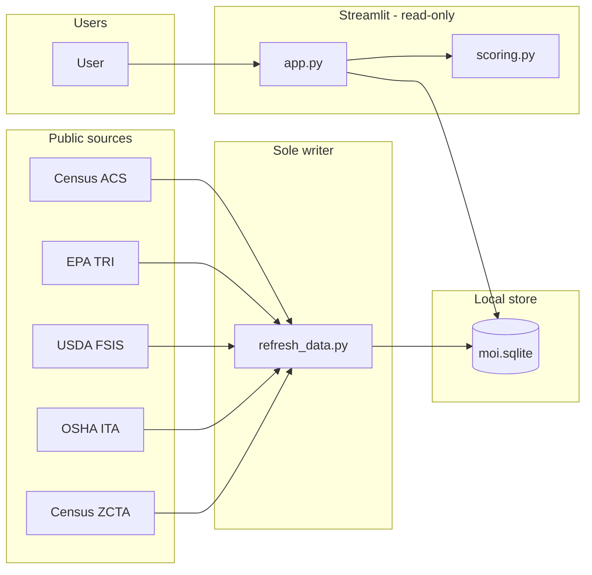
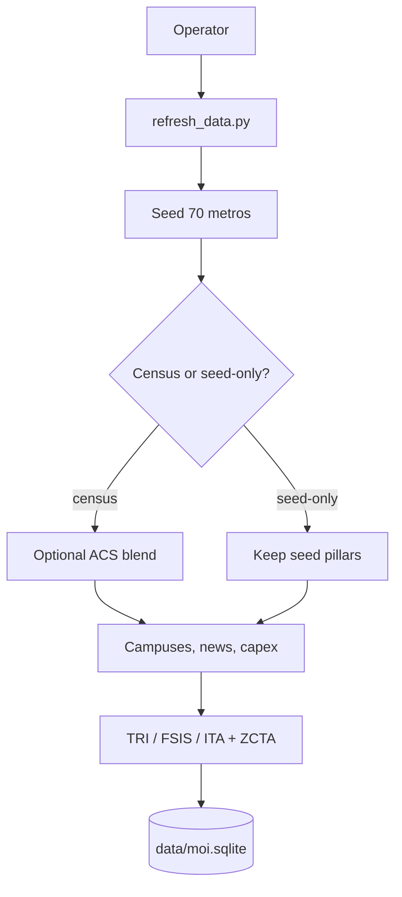
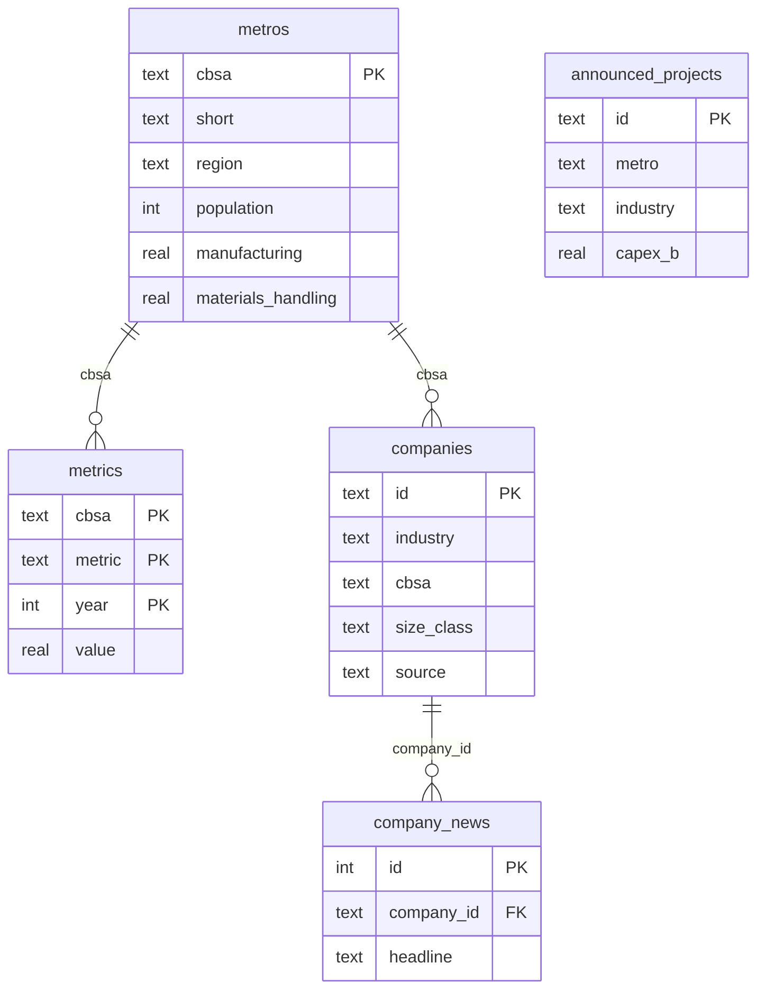

# US Manufacturing Opportunity Map

[](https://www.python.org/downloads/)
[](https://streamlit.io)
[](LICENSE)
[](ARCHITECTURE.md)

The **US Manufacturing Opportunity Map** (Manufacturing Opportunity Index) is an interactive Streamlit app that ranks 70 US metros for **manufacturing site selection** and **industrial real estate demand**. It scores markets for automotive, warehousing, food manufacturing, battery manufacturing, semiconductors, distribution centers, and materials handling & forklifts using Census ACS, EPA TRI, USDA FSIS, and OSHA ITA.

Built for manufacturers, industrial investors, site-selection consultants, economic development organizations, 3PL and logistics teams, industrial real estate brokers, and materials-handling / forklift dealers.

The industrial property market is showing renewed demand. Colliers reports US industrial demand exceeded new supply in Q2 2026 for the first time since 2022 — with manufacturing, 3PLs, food and beverage, and supply-chain diversification back in the occupier mix.

## Who it's for

Manufacturers, investors, consultants, EDOs, logistics companies, industrial real estate teams, and equipment dealers. The audience lens changes the narrative, not the math.

**Industries scored:** automotive · warehousing · food manufacturing · battery manufacturing · semiconductors · distribution centers · materials handling & forklifts

## Run

```bash
python -m venv .venv
.venv\Scripts\activate
pip install -r requirements.txt
python refresh_data.py
streamlit run app.py
```

Data lives in SQLite at `data/moi.sqlite`. The app reads that file; `refresh_data.py` is the only command that writes it.

```bash
python refresh_data.py              # Census ACS + seed blend into SQLite
python refresh_data.py --seed-only  # seed metros, then download TRI / FSIS / OSHA ITA plants
```

Optional: copy `.env.example` to `.env` and set `CENSUS_API_KEY` (free at https://api.census.gov/data/key_signup.html). Without a key, refresh still writes the seed panel, companies, news, Wave 3 layers, and TRI / FSIS / OSHA ITA plants to SQLite. ACS metro scores stay on the curated seed until a key is set.

Open [http://localhost:8501](http://localhost:8501) — **Opportunity map** for metro scores, **Companies and news** to click plants and DCs (Eastern zone + size filters), **Contact us** for the GitHub repo and a note form.

Azure App Service (Linux, Python 3.12) starts with `bash startup.sh`. That script launches `refresh_scheduler.py` in a **separate process**, then execs Streamlit on `0.0.0.0` and `PORT` / `WEBSITES_PORT` (8000). The scheduler reads the last successful `refresh_runs` row (or `data/last_refresh.txt`). It runs `python refresh_data.py` (full refresh, not `--seed-only`) only when this host has never succeeded or the last success is at least 7 days old — restarts and deploys do not re-hit EPA/OSHA when the last success is younger than 7 days. After a success it sleeps in 1-hour chunks until the next due time. Failures are logged to stdout and retried after 6 hours. Contact files in `mail/` are not touched. Always On must stay enabled so the scheduler is not frozen.

Optional App Setting: `CENSUS_API_KEY`. If unset, weekly refresh still updates TRI, FSIS, and ITA.

Package with `python scripts/package_app.py` (includes `data/moi.sqlite`, excludes `.venv`, `data/raw/`, `mail/*.txt`, and `.env`) and deploy with `scripts/deploy.ps1`.

## Public URL and Google search

This is a Streamlit app, not a static site. After App Service is live, Google indexes the public HTTPS URL (`https://us-opportunities.azurewebsites.net`), not the GitHub README. The tab title, meta description, Open Graph tags, and `robots.txt` (`/robots.txt` and `static/robots.txt`) are there so crawlers can still describe the US manufacturing opportunity map for site selection, industrial real estate, forklifts, warehousing, battery, and semiconductors.

## Architecture

`refresh_data.py` writes SQLite. Streamlit (`app.py`) is read-only and scores seven industries in memory, including materials handling.

**System context** — user, local app, SQLite, and public sources.



**Refresh / ingest** — seed 70 metros, optional ACS blend, then named plants into SQLite.



**Key tables**



Diagrams above are the GitHub-readable overview; the full write-up is in [ARCHITECTURE.md](ARCHITECTURE.md).

## What it scores

Each metro has five structural pillars (0–100) that do **not** change with industry:

| Pillar | What it represents |
| --- | --- |
| Manufacturing | Production base and supplier density |
| Logistics | Highway, rail, air cargo, and port access |
| Labor | Availability, cost, and skills |
| Warehouse | Industrial inventory, land, permit velocity |
| Growth | Population, output, and construction momentum |

**Score** is the Manufacturing Opportunity Index for the selected industry:

`MOI = (1 − λ) · Σ wᵢ · Pillarᵢ + λ · Cluster`

Switch to **Equal-weight pillars** to see a simple average of the five pillars (Indianapolis ~84.4, Columbus OH ~86.8, Dallas ~87.8, Atlanta ~85.8).

## Public data the model is built to ingest

Census ACS 1-year plus named plants and warehouses from **EPA TRI 2024**, the **USDA FSIS MPI directory**, and **OSHA ITA** Form 300A (mapped with Census ZIP centroids). `refresh_data.py` downloads those files into `data/raw/` and loads them into SQLite.

## License

MIT — see [LICENSE](LICENSE).
