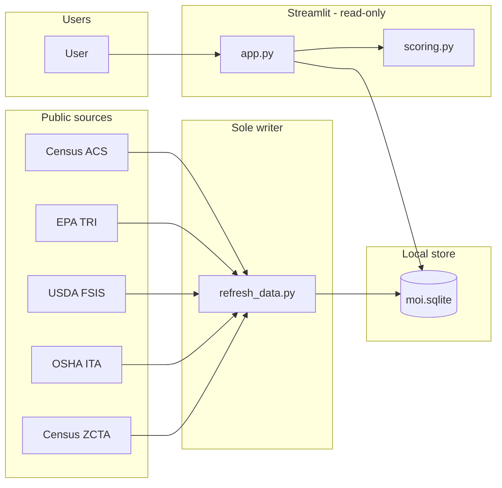
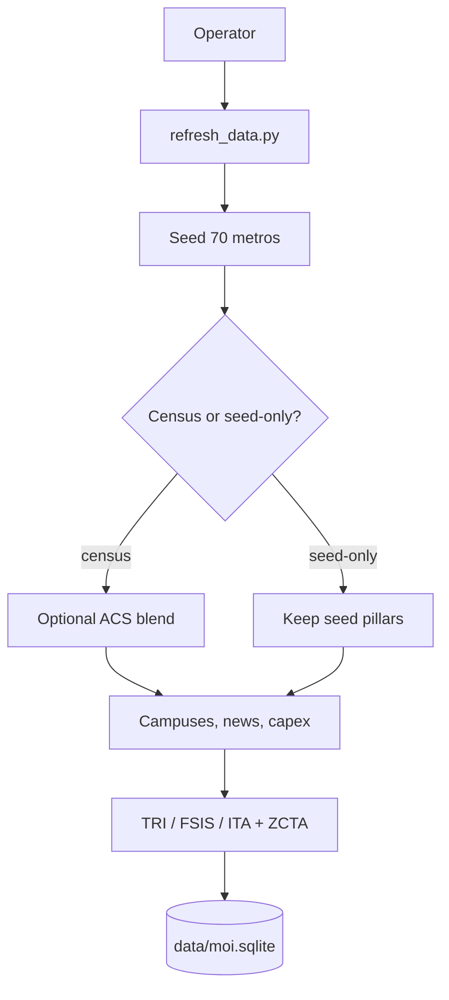
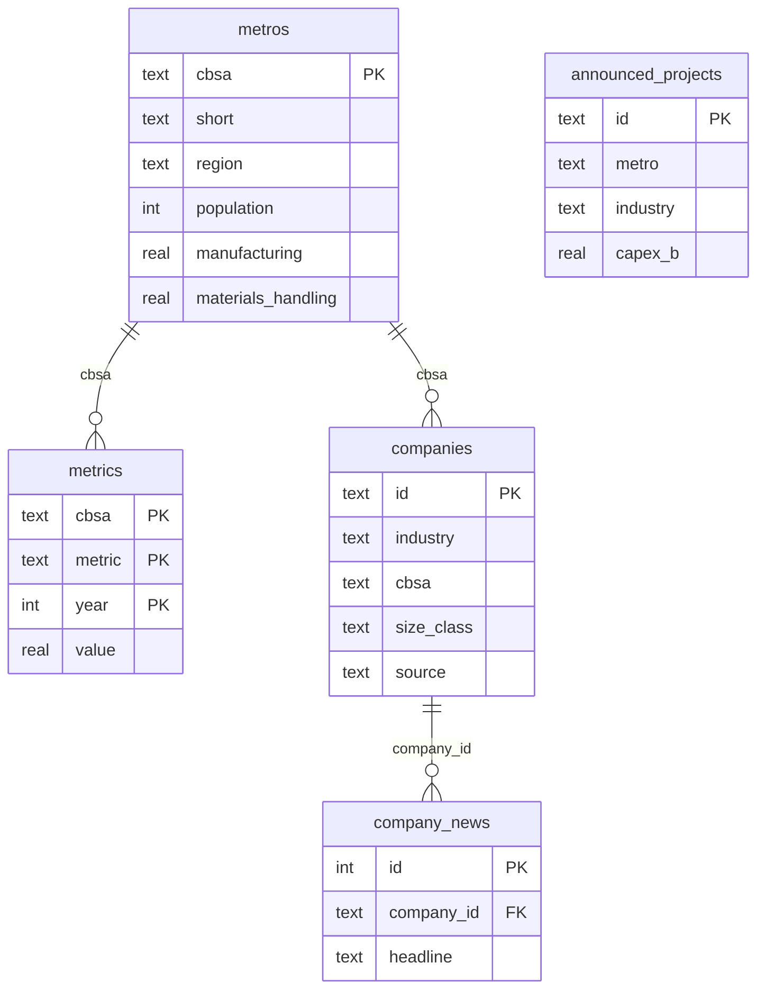

# Manufacturing Opportunity Index

Interactive US metro map that scores markets for **automotive**, **warehousing**, **food manufacturing**, **battery manufacturing**, **semiconductors**, **distribution centers**, and **materials handling & forklifts**.

The industrial property market is showing renewed demand. Colliers reports US industrial demand exceeded new supply in Q2 2026 for the first time since 2022 — with manufacturing, 3PLs, food and beverage, and supply-chain diversification back in the occupier mix. This app is a site-selection and industrial-demand lens for that cycle.

## Run

```bash
python -m venv .venv
.venv\Scripts\activate
pip install -r requirements.txt
python refresh_data.py
streamlit run app.py
```

Data lives in SQLite at `data/moi.sqlite`. The app reads that file; `refresh_data.py` is the only command that writes it.

```bash
python refresh_data.py              # Census ACS + seed blend into SQLite
python refresh_data.py --seed-only  # seed metros, then download TRI / FSIS / OSHA ITA plants
```

Optional: copy `.env.example` to `.env` and set `CENSUS_API_KEY` (free at https://api.census.gov/data/key_signup.html). Without a key, refresh still writes the seed panel, companies, news, and Wave 3 layers to SQLite.

Open [http://localhost:8501](http://localhost:8501) — **Opportunity map** for metro scores, **Companies and news** to click plants and DCs (Eastern zone + size filters).

## Architecture

`refresh_data.py` writes SQLite. Streamlit (`app.py`) is read-only and scores seven industries in memory, including materials handling.

**System context** — user, local app, SQLite, and public sources.



**Refresh / ingest** — seed 70 metros, optional ACS blend, then named plants into SQLite.



**Key tables**



Diagrams above are the GitHub-readable overview; the full write-up is in [ARCHITECTURE.md](ARCHITECTURE.md).

## What it scores

Each metro has five structural pillars (0–100) that do **not** change with industry:

| Pillar | What it represents |
| --- | --- |
| Manufacturing | Production base and supplier density |
| Logistics | Highway, rail, air cargo, and port access |
| Labor | Availability, cost, and skills |
| Warehouse | Industrial inventory, land, permit velocity |
| Growth | Population, output, and construction momentum |

**Score** is the Manufacturing Opportunity Index for the selected industry:

`MOI = (1 − λ) · Σ wᵢ · Pillarᵢ + λ · Cluster`

Switch to **Equal-weight pillars** to see a simple average of the five pillars (Indianapolis ~84.4, Columbus OH ~86.8, Dallas ~87.8, Atlanta ~85.8).

## Public data the model is built to ingest

Census ACS 1-year plus named plants and warehouses from **EPA TRI 2024**, the **USDA FSIS MPI directory**, and **OSHA ITA** Form 300A (mapped with Census ZIP centroids). `refresh_data.py` downloads those files into `data/raw/` and loads them into SQLite.

## Audience

Manufacturers, investors, consultants, economic development organizations, logistics companies, industrial real estate teams, and equipment dealers. The audience lens changes the narrative, not the math.
